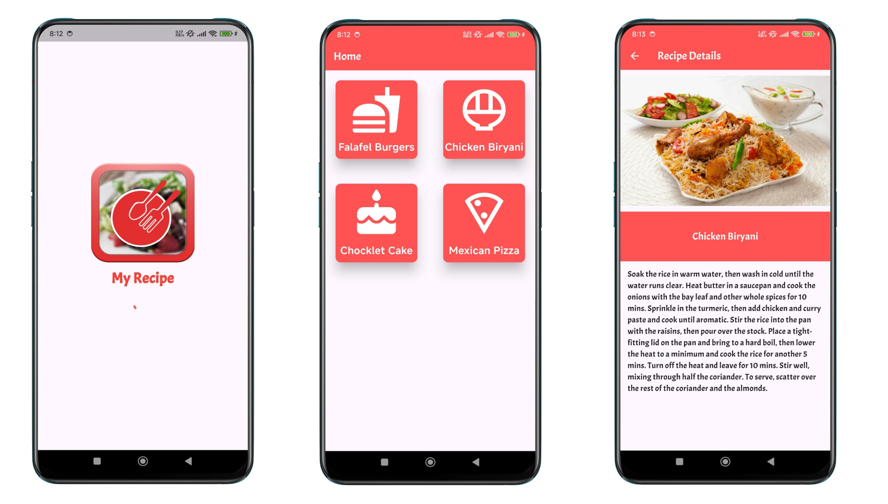

# Flutter Recipe App Example

Simple flutter recipe app example with splash screen, dashboard and details page

## What we will learn from this project

- How to create splash Screen
- Learn about Progress Indicator
- How to design a dashboard menu
- How to use Column and Row
- How to use container, image and text widget
- How to use GridView and Cards
- How to use gesture detector
- How to pass data between two screen
- How to navigate another screen
- How to use custom google fonts
- How to use toast
- How to use MediaQuery
- How to design a details page
- Learn about Flexible widget
- Learn about scrollview

## Live demo
https://noormohammedanik.github.io/flutter_recipe_app/
